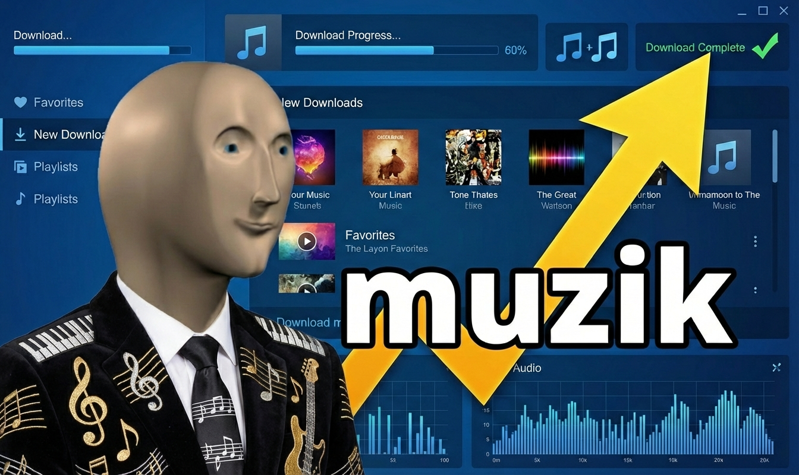

# muzik



Music organizer CLI — download, split, and organize music from YouTube and Bandcamp.

---

Wraps **yt-dlp**, **ffmpeg**, and **beets** with better progress feedback and an interactive chapter editor. Also downloads your full Bandcamp collection.

## Requirements

- Python 3.11+
- [`uv`](https://github.com/astral-sh/uv)
- `yt-dlp`, `ffmpeg`, `ffprobe` on `$PATH`

## Install

```sh
git clone <repo>
cd muzik
uv sync
uv run playwright install chromium
uv run muzik init
```

## Commands

| Command | Description |
|---------|-------------|
| `muzik init` | Create XDG directories and configure beets |
| `muzik workflow <url>` | Full pipeline: download → split → organize |
| `muzik download <url>` | Download audio from YouTube via yt-dlp |
| `muzik bandcamp` | Download Bandcamp collection and organize with beets |
| `muzik split <file>` | Split audio file by chapters (with optional `--review`) |
| `muzik organize <dir>` | Tag/import audio with beets |
| `muzik import <dir>` | Import an existing music library into beets |
| `muzik archive <dir>` | Process existing downloaded files (split + organize) |
| `muzik validate <dir>` | Validate audio files, chapters, and metadata |
| `muzik cache` | Manage the `~/.cache/music-scripts` cache |
| `muzik config` | Manage beets configuration |

## Credits

- Bandcamp collection downloading is a Python port of [bandsnatch](https://github.com/Ovyerus/bandsnatch)
- Audio downloading via [yt-dlp](https://github.com/yt-dlp/yt-dlp)
- Audio processing via [FFmpeg](https://ffmpeg.org/)
- Music library management via [beets](https://beets.io/)

## Quick start

```sh
# Download, split by chapters, and import into beets
muzik workflow "https://youtube.com/watch?v=..."

# Download your full Bandcamp collection (opens browser on first run)
muzik bandcamp

# Import an existing music collection
muzik import ~/Music --copy
```
