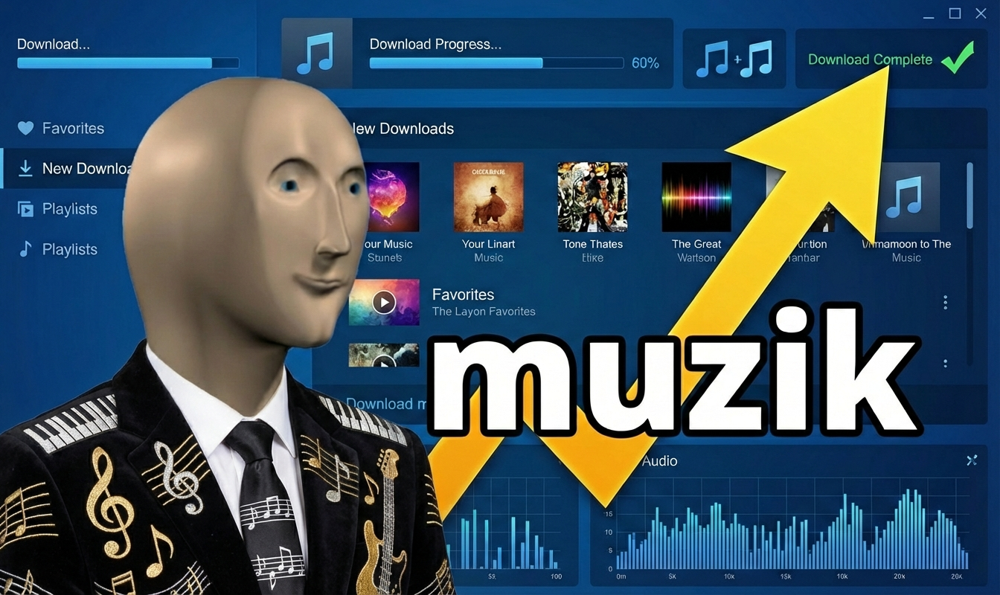

# muzik



Music organizer CLI — download, split, and organize music from Soulseek, YouTube,
and Bandcamp.

---

Wraps **slskd**, **yt-dlp**, **ffmpeg**, and **beets** with better progress
feedback and an interactive chapter editor. Soulseek is used for higher-quality
audio acquisition when configured; yt-dlp remains available for YouTube metadata,
playlist parsing, and fallback audio downloads. Chapter sidecars can come from
`.chapters.txt`, yt-dlp `.info.json`, or album `.cue` sheets. Also downloads
your full Bandcamp collection.

## Requirements

- Python 3.11+
- [`uv`](https://github.com/astral-sh/uv)
- `yt-dlp`, `ffmpeg`, `ffprobe` on `$PATH`
- Optional for Soulseek: a running [`slskd`](https://github.com/slskd/slskd)
  instance

Check external tools before running a full workflow:

```sh
yt-dlp --version
ffmpeg -version
ffprobe -version
uv run muzik soulseek check      # when using Soulseek/slskd
uv run playwright install chromium
```

Bandcamp collection downloads use Playwright browser automation. The first
Bandcamp run opens a browser so you can log in, then stores cookies under the
app data directory.

## Soulseek setup

Configure `muzik` to talk to `slskd` with environment variables:

```sh
export SLSKD_URL="http://localhost:5030"
export SLSKD_API_KEY="your-slskd-api-key"
export SLSKD_DOWNLOAD_DIR="$HOME/.local/share/muzik/soulseek"
```

`SLSKD_DOWNLOAD_DIR` must match the local filesystem path where completed slskd
downloads appear, so `muzik` can validate and organize them.

`SLSKD_API_KEY` only authenticates `muzik` to the slskd API. slskd must also be
logged in to the Soulseek network. In the slskd config mounted at
`/app/slskd.yml`, set:

```yaml
soulseek:
  username: your-soulseek-username
  password: your-soulseek-password
```

Then restart slskd and run `muzik soulseek check`; it should report both
`Soulseek connected: True` and `Soulseek logged in: True`.

## Install

```sh
git clone <repo>
cd muzik
uv sync
uv run playwright install chromium
uv run muzik init
```

## Commands

| Command | Description |
|---------|-------------|
| `muzik init` | Create XDG directories and configure beets |
| `muzik workflow <url>` | Full pipeline: download → split → organize |
| `muzik download <url>` | Download audio from YouTube via yt-dlp |
| `muzik soulseek check` | Verify slskd connectivity and auth |
| `muzik soulseek search <query>` | Search Soulseek and rank candidates |
| `muzik soulseek download <query>` | Search Soulseek and enqueue a selected download |
| `muzik bandcamp` | Download Bandcamp collection and organize with beets |
| `muzik split <file>` | Split audio file by chapters (with optional `--review`) |
| `muzik organize <dir>` | Tag/import audio with beets |
| `muzik import <dir>` | Import an existing music library into beets |
| `muzik archive <dir>` | Process existing downloaded files (split + organize) |
| `muzik validate <dir>` | Validate audio files, chapters, and metadata |
| `muzik tui` | Open the Textual workflow UI |
| `muzik cache` | Manage the `~/.cache/music-scripts` cache |
| `muzik config` | Manage beets configuration |

## Textual TUI

Run the terminal UI with:

```sh
uv run muzik tui
```

The TUI provides a workflow launcher, pipeline progress/log view, source
candidate table, chapter review/editor, and beets match/duplicate decision
screens. It uses the same workflow and beets service layer as the CLI, with
long-running workflow work executed in Textual workers so the interface remains
responsive.

Textual is the first GUI target for this project. A native PySide6 desktop app
should only be evaluated after this service boundary has been validated in
regular use.

## Credits

- Bandcamp collection downloading is a Python port of [bandsnatch](https://github.com/Ovyerus/bandsnatch)
- Soulseek integration via [slskd](https://github.com/slskd/slskd)
- YouTube metadata and fallback audio via [yt-dlp](https://github.com/yt-dlp/yt-dlp)
- Audio processing via [FFmpeg](https://ffmpeg.org/)
- Music library management via [beets](https://beets.io/)

## Quick start

```sh
# Download, split by chapters, and import into beets
muzik workflow "https://youtube.com/watch?v=..."

# Search Soulseek for a FLAC/lossless album candidate
muzik soulseek search "Artist - Album flac"

# Download a selected Soulseek candidate
muzik soulseek download "Artist - Album" --prefer flac

# Or download a candidate ID shown by `muzik soulseek search`
muzik soulseek download --candidate <id>

# Use YouTube metadata/playlist parsing but Soulseek for audio
muzik workflow "https://youtube.com/watch?v=..." --audio-source soulseek --prefer flac

# Fall back to YouTube audio if Soulseek finds no acceptable candidate
muzik workflow "https://youtube.com/watch?v=..." --audio-source soulseek --fallback youtube

# Download your full Bandcamp collection (opens browser on first run)
muzik bandcamp

# Import an existing music collection
muzik import ~/Music --copy
```

Only download music you are authorized to access.
