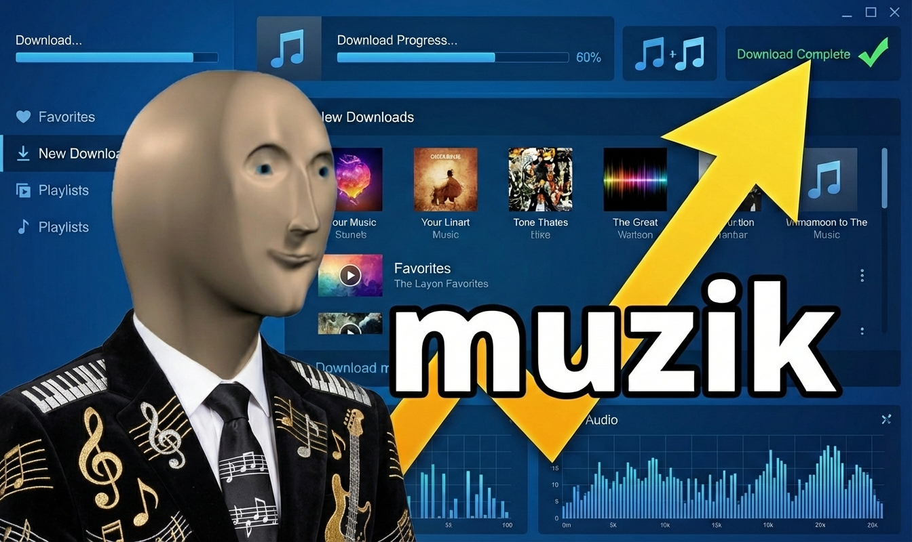

# muzik



Music organizer CLI — download, split, and organize music from Soulseek, YouTube,
and Bandcamp.

---

Wraps **slskd**, **yt-dlp**, **ffmpeg**, and **beets** with better progress
feedback and an interactive chapter editor. Soulseek is used for higher-quality
audio acquisition when configured; yt-dlp remains available for YouTube metadata,
playlist parsing, and fallback audio downloads. Chapter sidecars can come from
`.chapters.txt`, yt-dlp `.info.json`, or album `.cue` sheets. Also downloads
your full Bandcamp collection.

## Requirements

- Python 3.14+
- [`uv`](https://github.com/astral-sh/uv)
- `yt-dlp`, `ffmpeg`, `ffprobe` on `$PATH`
- Optional for Soulseek: a running [`slskd`](https://github.com/slskd/slskd)
  instance

Check external tools before running a full workflow:

```sh
yt-dlp --version
ffmpeg -version
ffprobe -version
uv run muzik soulseek check      # when using Soulseek/slskd
uv run playwright install chromium
```

Bandcamp collection downloads use Playwright browser automation. The first
Bandcamp run opens a browser so you can log in, then stores cookies under the
app data directory.

### macOS arm64 prerequisites

Install the required command-line tools and confirm that they are on `PATH`:

```sh
brew install ffmpeg yt-dlp
ffmpeg -version
ffprobe -version
yt-dlp --version
```

Before you use Bandcamp, install the Playwright Chromium browser once from a
source checkout:

```sh
uv run playwright install chromium
```

## Soulseek setup

Configure `muzik` to talk to `slskd` with environment variables:

```sh
export SLSKD_URL="http://localhost:5030"
export SLSKD_API_KEY="your-slskd-api-key"
export SLSKD_DOWNLOAD_DIR="$HOME/.local/share/muzik/soulseek"
```

`SLSKD_DOWNLOAD_DIR` must match the local filesystem path where completed slskd
downloads appear, so `muzik` can validate and organize them.

`SLSKD_API_KEY` only authenticates `muzik` to the slskd API. slskd must also be
logged in to the Soulseek network. In the slskd config mounted at
`/app/slskd.yml`, set:

```yaml
soulseek:
  username: your-soulseek-username
  password: your-soulseek-password
```

Then restart slskd and run `muzik soulseek check`; it should report both
`Soulseek connected: True` and `Soulseek logged in: True`.

## Install

Install the GitHub release wheel as an isolated command-line tool:

```sh
uv tool install \
  https://github.com/TudorAndrei/muzik/releases/download/v0.1.0/muzik-0.1.0-py3-none-any.whl
muzik --help
```

For development, install from a source checkout:

```sh
git clone <repo>
cd muzik
uv sync
uv run playwright install chromium
uv run muzik init
```

## Development

Run the complete locked local and CI verification gate with:

```sh
mise run check
```

The same checks run in CI and as individual pre-push hooks.

## Workflow source policy

`--audio-source` chooses where audio comes from: `youtube`, `soulseek`, or
`auto`. `auto` uses Soulseek when the configured service is ready and otherwise
uses YouTube for YouTube inputs. `--fallback youtube` is available only when a
YouTube input has no acceptable Soulseek result. `--metadata-source` controls
chapter/metadata lookup for downloaded audio: `youtube`, `musicbrainz`, `none`,
or `auto`.

Local audio paths are processed without remote acquisition. Spotify export files
are detected before local audio discovery and are the exception to the fallback
rule: they are metadata-only and require Soulseek or a ready `auto` source.

## Commands

| Command | Description |
|---------|-------------|
| `muzik init` | Create app directories and configure beets |
| `muzik workflow <url-or-path>` | Full pipeline: acquire → split → organize |
| `muzik download <url>` | Download audio from YouTube via yt-dlp |
| `muzik soulseek check` | Verify slskd connectivity and auth |
| `muzik soulseek search <query>` | Search Soulseek and rank candidates |
| `muzik soulseek download <query>` | Search Soulseek and enqueue a selected download |
| `muzik bandcamp` | Download Bandcamp collection and organize with beets |
| `muzik split <file>` | Split audio file by chapters (with optional `--review`) |
| `muzik organize <dir>` | Tag/import audio with beets |
| `muzik import <dir>` | Import an existing music library into beets |
| `muzik archive <dir>` | Process existing downloaded files (split + organize) |
| `muzik validate <dir>` | Validate audio files, chapters, and metadata |
| `muzik gui` | Open the DearPyGui workflow interface |
| `muzik cache` | Manage the platform-specific `muzik` cache |
| `muzik config` | Manage beets configuration |

## Spotify playlist exports

`muzik` accepts a canonical version-1 Spotify playlist JSON file and
Exportify-style CSV files as metadata-only workflow inputs. It does not sign in
to Spotify, call the Spotify API, or pass Spotify URLs to `yt-dlp`.

Use Soulseek (or `auto` when `muzik soulseek check` reports ready) to acquire
audio for the exported tracks:

```sh
uv run muzik workflow playlist.spotify.json --audio-source soulseek --fallback none
uv run muzik workflow exportify-playlist.csv --audio-source soulseek --fallback none
```

Spotify exports reject episodes and require track title, artist, positive unique
position, and a deterministic track identity. Local tracks are supported with a
stable synthetic identity. Re-running an updated export skips entries already
organized by track ID, tolerates reordering, and acquires only new entries.
`--audio-source youtube` is intentionally rejected for Spotify exports.

See [SPOTIFY.md](SPOTIFY.md) for the supported JSON/CSV fields and the
metadata-only policy.

## Desktop interface

Run the desktop interface with:

```sh
uv run muzik gui
```

The interface provides a workflow launcher, pipeline progress and logs, source
candidate tables, chapter review and editing, and Beets match and duplicate
decisions. It uses the same workflow and Beets service layer as the CLI. Long
work runs in a background thread. Back requests cooperative cancellation and
waits for the worker to stop before it returns to the launcher.

## Credits

- Bandcamp collection downloading is a Python port of [bandsnatch](https://github.com/Ovyerus/bandsnatch)
- Soulseek integration via [slskd](https://github.com/slskd/slskd)
- YouTube metadata and fallback audio via [yt-dlp](https://github.com/yt-dlp/yt-dlp)
- Audio processing via [FFmpeg](https://ffmpeg.org/)
- Music library management via [beets](https://beets.io/)

## Quick start

```sh
# Download, split by chapters, and import into beets
muzik workflow "https://youtube.com/watch?v=..."

# Search Soulseek for a FLAC/lossless album candidate
muzik soulseek search "Artist - Album flac"

# Download a selected Soulseek candidate
muzik soulseek download "Artist - Album" --prefer flac

# Or download a candidate ID shown by `muzik soulseek search`
muzik soulseek download --candidate <id>

# Use YouTube metadata/playlist parsing but Soulseek for audio
muzik workflow "https://youtube.com/watch?v=..." --audio-source soulseek --prefer flac

# Fall back to YouTube audio if Soulseek finds no acceptable candidate
muzik workflow "https://youtube.com/watch?v=..." --audio-source soulseek --fallback youtube

# Download your full Bandcamp collection (opens browser on first run)
muzik bandcamp

# Import an existing music collection
muzik import ~/Music --copy
```

Bandcamp setup stores the authenticated cookies and username in the app config
directory. Cookie scope is preserved; use `muzik bandcamp --setup` to log in
again after expiry. Only releases downloaded successfully in a run are sent to
Beets for organization.

Only download music you are authorized to access.
